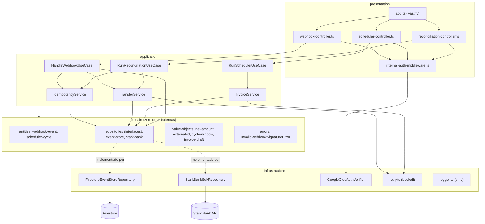
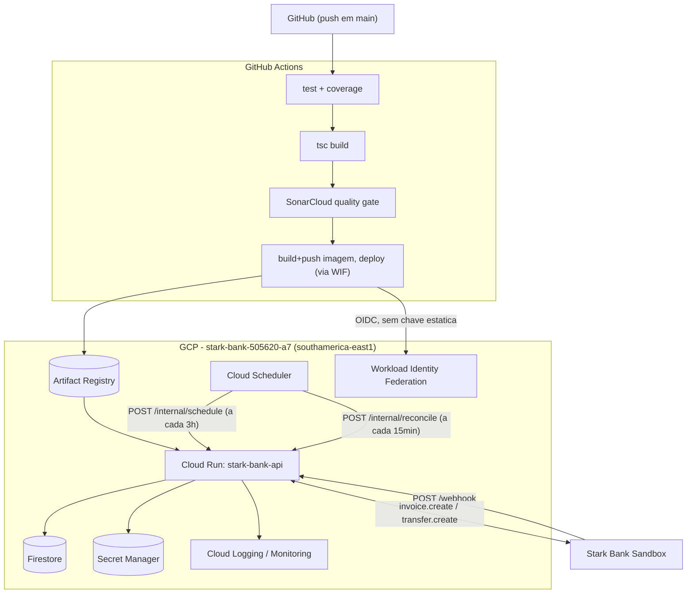
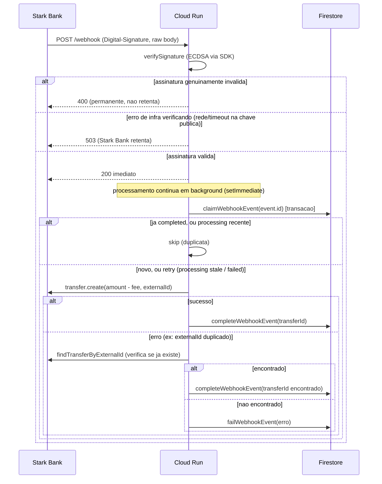
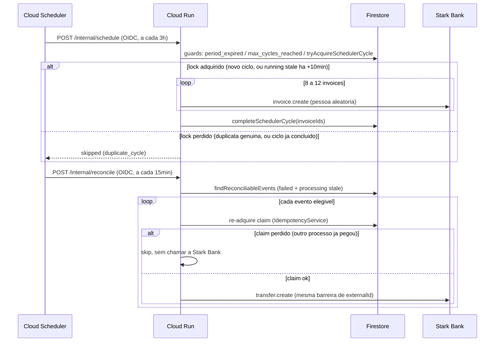

# Stark Bank Challenge — Backend Node.js/TypeScript

[](https://github.com/Rafael-Galdino/stark-bank-challenge/actions/workflows/pipeline.yml)
[](#testes)
[](#stack)
[](#stack)
[](#deploy-passo-a-passo)

Backend do teste técnico para a vaga de Staff Software Engineer na Stark Bank.

O fluxo é: emitir invoices em lotes agendados, receber o webhook quando uma delas é paga no sandbox, e transferir o valor líquido (`amount - fee`) para uma conta fixa da Stark Bank. O ponto central não é o CRUD contra a API — é garantir que nenhum centavo se perca ou se duplique quando webhook, scheduler e a própria API sandbox se comportam de forma imperfeita (entrega repetida, disparo duplicado, falha transitória).

**Projeto GCP utilizado:** `stark-bank-505620-a7` (região `southamerica-east1`)
**Documentação Stark Bank:** [API](https://starkbank.com/docs/api) · [Invoice](https://starkbank.com/docs/api#invoice) · [Transfer](https://starkbank.com/docs/api#transfer) · [Webhook](https://starkbank.com/docs/api#webhook) · [Gerar chaves ECDSA](https://starkbank.com/faq/how-to-create-ecdsa-keys)

---

## Escopo do desafio

1. Criar um **Project** e registrar um **Webhook** no ambiente Sandbox da Stark Bank.
2. Emitir **8 a 12 Invoices a cada 3 horas, por 24 horas** (8 ciclos, entre 64 e 96 invoices no total) para pessoas aleatórias.
3. O sandbox paga automaticamente parte dessas invoices.
4. Ao receber o webhook do log `credited` de uma invoice, fazer um **Transfer** do valor recebido menos as taxas para a conta abaixo.
5. Publicar o código e, como bônus, rodar em cloud.

**Conta destino do transfer** (fonte: [`seed/transfer-target.json`](seed/transfer-target.json), seedado no Firestore em `starkbank_challenge_config/transfer_target`):

| Campo | Valor |
|-------|-------|
| bankCode | `20018183` |
| branchCode | `0001` |
| accountNumber | `6341320293482496` |
| name | Stark Bank S.A. |
| taxId | `20.018.183/0001-80` |
| accountType | `payment` |

---

## O desafio central

Encaro o problema real deste teste como **correção financeira sob entrega at-least-once**, não como integração de API. Três fontes de duplicidade/perda coexistem por design nesse tipo de sistema:

- a Stark Bank **retenta webhooks** que não recebem 200 rápido o suficiente;
- o Cloud Scheduler é **at-least-once** — pode disparar o mesmo job duas vezes no mesmo horário;
- a própria API sandbox pode falhar de forma transitória no meio de uma chamada.

Em qualquer uma dessas situações, o sistema não pode transferir em duplicidade nem perder silenciosamente um evento `credited`. Isso é o tipo de bug que não aparece em teste feliz — só aparece sob crash, corrida ou reentrega, exatamente o que uma revisão superficial não pega.

### Duas barreiras de idempotência, não uma

1. **Claim transacional no Firestore** por `event.id` — `webhook_events/{eventId}` transiciona `processing → completed/failed` dentro de uma transação, o que serializa duas entregas concorrentes de um webhook novo. Um evento `processing` travado há mais de 5 minutos (worker morto) é retentado; um evento `failed` também é retentado imediatamente, preservando `attempts`/`createdAt`/`lastError` em vez de resetar o histórico de auditoria.
2. **`externalId` no Transfer** (`invoice-{invoiceId}`) — a Stark Bank rejeita um segundo transfer com o mesmo `externalId` ("Duplicated externalIds will cause failures", conforme o próprio SDK documenta). Essa é a barreira de backstop: mesmo que a primeira falhe ou corra, o dinheiro não sai duas vezes.

O ponto fino — e onde encontrei a maioria dos bugs na auto-revisão — é que a **primeira barreira precisa saber conversar com a segunda**. Se a Stark Bank rejeita por `externalId` duplicado, isso significa "já tive sucesso antes", não "falhei agora"; tratar os dois casos da mesma forma rotula um pagamento bem-sucedido como `failed` para sempre. O `TransferService` agora busca o transfer existente antes de declarar falha (`findTransferByExternalId`), exatamente para fechar essa lacuna.

### Sugestão de evolução para o ambiente produtivo

Para o volume deste desafio (64–96 invoices em 24h, dezenas de webhooks), processamento síncrono dentro do próprio Cloud Run — webhook responde 200 e processa o transfer em background via `setImmediate`, reconciliação varre o Firestore a cada 15 minutos — é proporcional. Eu **não** levaria esse desenho como está para o volume e o rigor de produção real de uma fintech, embora os princípios (idempotência em camada dupla, estado auditável no Firestore, fail-closed em vez de fail-open) continuassem os mesmos.

A evolução natural seria separar **ingestão** de **processamento**:

| Camada | Hoje (este repo) | Em produção de alto volume | Ganho |
|--------|-------------------|------------------------------|-------|
| Ingestão do webhook | Valida assinatura e processa tudo no mesmo request handler (background via `setImmediate`) | Serviço fino que só valida ECDSA, persiste o evento bruto e publica num tópico (Pub/Sub) | Desacopla o tempo de resposta à Stark Bank do tempo de processamento; absorve pico sem represar o handler HTTP |
| Execução do transfer | `TransferService` chamado inline no mesmo processo | Consumidor idempotente dedicado, escalando à parte | Retry/backoff/DLQ por assinatura, sem competir por recursos com o caminho de ingestão |
| Scheduler de invoices | Mesmo serviço, mesmo processo | Worker dedicado ou Cloud Tasks com fila própria | Falha no lote de invoices não compete com o caminho crítico do webhook |
| Observabilidade | Logs estruturados + guard clauses | Métricas de negócio (centavos em risco, taxa de `duplicate_skipped`, lag de fila) com alerta por SLO | Detecta anomalia financeira antes de virar incidente |

Um ponto que vale deixar explícito: **fila não substitui idempotência, só muda onde ela precisa acontecer** — o consumidor de um tópico Pub/Sub ainda recebe redelivery e ainda precisa do mesmo claim transacional que já existe aqui. É por isso que mantive o claim como o conceito central da solução, mesmo sem barramento neste repositório: é a peça que sobrevive à mudança de topologia.

Microsserviço entraria por motivo operacional concreto (times diferentes, cadência de deploy diferente, perfil de escala divergente entre ingestão latency-sensitive e lote batch) — não como default. Para este teste, a escolha consciente foi provar entendimento do problema de dinheiro em sistema distribuído com o mínimo de peças móveis, e documentar aqui onde a próxima camada de resiliência entraria se volume/criticidade justificassem.

---

## Arquitetura

Clean Architecture em 4 camadas, regra de dependência estrita (a camada externa depende da interna, nunca o inverso). `src/main.ts` é o composition root — único lugar que instancia implementações concretas e as injeta via construtor.



### Design patterns aplicados

| Pattern | Onde | Por quê |
|---------|------|---------|
| **Dependency Inversion (interfaces de domínio)** | `domain/repositories/*` implementadas em `infrastructure/repositories/*` | Serviços de aplicação testam contra mocks (`InMemoryEventStore`, `MockStarkBankRepository`); zero I/O real em teste unitário |
| **Claim transacional (idempotência)** | `claimWebhookEvent`, `tryAcquireSchedulerCycle` (transações Firestore) | Webhook e Scheduler entregam at-least-once; sem transação, duas leituras concorrentes veem "não existe" e ambas seguem |
| **Recuperação de duplicidade** | `TransferService.findExistingTransfer` | Diferencia "falhou de verdade" de "já teve sucesso, rejeitado por externalId duplicado" — sem isso, sucesso vira `failed` permanente |
| **Retry com backoff exponencial + jitter** | `withRetry` em `createInvoice`/`createTransfer` | Absorve instabilidade transitória do sandbox sem martelar a API |
| **Fire-and-forget com resposta imediata** | Webhook responde 200 antes de processar o transfer (`setImmediate`) | A Stark Bank não deve esperar o transfer terminar pra receber o ack |
| **Erro tipado por domínio** | `InvalidWebhookSignatureError` | Distingue assinatura genuinamente inválida (400, permanente) de erro de infraestrutura verificando a assinatura (5xx, retry) — os dois eram indistinguíveis antes da correção |
| **Funções puras de domínio** | `net-amount-vo`, `cycle-window-vo`, `external-id-vo`, `invoice-draft-vo` | Regra de negócio testável sem I/O (100% de cobertura de branch nessas funções) |

### Infra GCP



### Fluxo do webhook



### Fluxo do scheduler e da reconciliação



---

## Matriz de decisão

| Decisão | Escolha | Alternativas consideradas | Motivo |
|---|---|---|---|
| Mensageria | Processamento síncrono no Cloud Run (fire-and-forget) | Pub/Sub, Cloud Tasks | Volume baixo (64–96 invoices/24h). Fila não elimina idempotência nem reconciliação, só adiciona infra e superfície de debug pra este volume |
| Compute | 1 serviço Cloud Run, camadas separadas no código | N microsserviços | Mesmo domínio, mesmo SDK, mesmo Firestore — separar deploy não traz ganho aqui |
| Banco de estado | Firestore Native | Cloud SQL, Redis | Transação atômica nativa (essencial pro claim), free tier generoso, zero ops pro volume do teste |
| Idempotência de webhook | Claim transacional por `event.id`, com retry imediato em `failed` | Só `externalId` no Transfer | Stark Bank entrega at-least-once — sem as duas barreiras, `failed` vira estado terminal incorreto |
| Idempotência de transfer | `externalId: invoice-{invoiceId}` + lookup de recuperação em caso de rejeição | `externalId` sem lookup de recuperação | Sem o lookup, um transfer que já teve sucesso e foi rejeitado por duplicidade fica marcado `failed` pra sempre |
| Falha pós-200 | Reconciliação a cada 15min, **re-adquirindo o claim** antes de chamar a Stark Bank | Retry inline; reconciliação sem re-claim | Sem re-claim, duas execuções concorrentes de reconciliação (ou reconciliação x reentrega de webhook) competem pelo mesmo `externalId` sem coordenação |
| Scheduler duplicado | Lock transacional por `cycleId`, com recuperação de `running` obsoleto (+10min) | Confiar no Cloud Scheduler | At-least-once do Scheduler; sem recovery, um crash no meio do lote trava o ciclo pra sempre |
| Assinatura inválida vs. erro de infra | 400 só para assinatura genuinamente inválida (`InvalidWebhookSignatureError`); qualquer outro erro (rede/timeout buscando a chave pública) → 503 | 400 para qualquer erro em `verifySignature` | A Stark Bank trata 4xx como permanente e não retenta — confundir com falha transitória perde o webhook de uma invoice paga de forma silenciosa |
| Cold start | `--min-instances=1` | scale to zero | Webhook não pode esperar cold start; também reduz a janela sem cache da chave pública ECDSA |
| Endpoints internos | OIDC do Cloud Scheduler, audience = URL do próprio Cloud Run | API key estática | Sem segredo estático pra vazar; nativo do Cloud Run/Scheduler |
| CI/CD | GitHub Actions completo — test → build → SonarCloud → deploy, autenticando na GCP via Workload Identity Federation | Deploy manual; chave JSON de service account | Sem chave estática commitável no repo/secrets; deploy é gate de qualidade (coverage 80% + Sonar) antes de subir |
| HTTP framework | Fastify | Express | Precisa de raw body isolado por escopo de plugin pra validação ECDSA, sem afetar o parsing JSON das demais rotas |

---

## Recursos GCP

| Recurso | Função | Trade-off |
|---|---|---|
| **Cloud Run** (`stark-bank-api`) | API HTTP: webhook, schedule, reconcile | Cold start mitigado com `min-instances=1`; timeout de 60s no deploy atual |
| **Cloud Scheduler** | 2 jobs: `invoice-batch` (`0 */3 * * *`, `America/Sao_Paulo`) e `reconciliation` (`*/15 * * * *`) | At-least-once — coberto pelo lock/claim no Firestore, não pela confiança no Scheduler |
| **Firestore** (Native) | Estado, idempotência, auditoria, config (conta destino, run do scheduler) | Não serve pra analytics pesado — não é o caso aqui |
| **Secret Manager** | Chave privada ECDSA e `STARKBANK_PROJECT_ID` | Latência extra no cold start (aceitável) |
| **Artifact Registry** | Imagens Docker (build+push feito pelo próprio runner do GitHub Actions) | Mais um recurso pra provisionar antes do 1º deploy |
| **Workload Identity Federation** | Auth GitHub Actions → GCP sem chave estática de longa duração | Setup inicial (pool + provider + binding) mais verboso que uma SA key, mas sem segredo vazável |
| **Cloud Logging / Monitoring** | Logs estruturados JSON nativos do Cloud Run | Dashboards/alertas precisam ser criados manualmente |
| Pub/Sub (não usado) | — | Desacoplamento e absorção de pico — desproporcional ao volume deste desafio (ver [seção de arquitetura](#o-que-eu-faria-diferente-em-produção-de-missão-crítica)) |

**Custo:** tudo cabe no free tier/créditos iniciais da GCP para 24h com 64–96 invoices. O único custo recorrente relevante é `min-instances=1` no Cloud Run, e mesmo assim é baixo.

---

## Resiliência e cenários de borda

| Cenário | Comportamento |
|---|---|
| API Stark Bank fora do ar criando invoice | Retry com backoff (até 4 tentativas). Falha isolada não derruba o lote — ciclo marcado `partial_failure`, restante das invoices segue |
| Transfer rejeitado por `externalId` duplicado (já teve sucesso antes) | `TransferService` busca o transfer existente antes de declarar falha; se encontrado, completa como sucesso normal em vez de marcar `failed` |
| Webhook duplicado (reentrega da Stark Bank) | `event.id` já `completed` → claim retorna `skip`, sem novo transfer |
| Evento `failed` reentregue ou reconciliado | Claim retenta imediatamente, preservando `attempts`/`createdAt`/`lastError` (não reseta como um evento novo) |
| Reconciliação concorrente (2 disparos do Scheduler, ou reconciliação x webhook) | Cada evento re-adquire o claim antes de chamar a Stark Bank; quem perde a corrida pula sem tocar a API |
| Scheduler dispara 2x no mesmo horário | Lock transacional por `cycleId` — segunda tentativa vê `running` fresco e pula (`duplicate_cycle`) |
| Processo crasha no meio do lote de invoices | Ciclo `running` há mais de 10min é tratado como recuperável — próxima tentativa retoma o lock em vez de travar pra sempre |
| `fee >= amount` | Marca como `completed` sem tentar transfer, log de warning — não fica preso em loop de reconciliação |
| Assinatura ECDSA genuinamente inválida | 400, sem processar |
| Erro de infra verificando a assinatura (rede/timeout na chave pública) | 503 — a Stark Bank retenta, o webhook não é perdido |

### Máquina de estados (`webhook_events`)

```
(novo evento)
      │
      ▼
  processing ──────sucesso─────► completed
      │  ▲
      │  └── stale (+5min) ─ retry, attempts++, mesmo doc
      │
      erro
      ▼
   failed ── retry imediato (preserva createdAt/lastError) ──► processing
```

---

## Observabilidade

Logs estruturados em JSON via [pino](https://github.com/pinojs/pino), com campo `message` fixo por evento de negócio — filtrável direto no Cloud Logging:

```json
{
  "level": 30,
  "message": "transfer.created",
  "eventId": "5258020443389952",
  "invoiceId": "4600131349381120",
  "transferId": "5412038532661248",
  "amount": 400000,
  "fee": 50,
  "netAmount": 399950,
  "durationMs": 320
}
```

**Mensagens estruturadas emitidas pelo sistema:**

| `message` | Quando |
|---|---|
| `webhook.received` | Toda entrega de webhook com assinatura válida |
| `webhook.invoice_credited` | Log `credited` de invoice, antes do claim |
| `webhook.duplicate_skipped` | Claim retornou `skip` (evento já tratado, ou em andamento) |
| `webhook.invalid_signature` | Assinatura genuinamente inválida → 400 |
| `webhook.signature_verification_infra_error` | Erro de infra verificando a assinatura → 503 |
| `webhook.background_error` | Erro não tratado no processamento em background |
| `transfer.created` | Transfer criado com sucesso |
| `transfer.skipped_fee_gte_amount` | `fee >= amount`, completado sem transfer |
| `transfer.recovered_from_duplicate` | Erro na criação, mas transfer já existia — recuperado como sucesso |
| `transfer.failed` | Falha real, sem transfer existente encontrado |
| `scheduler.cycle_completed` | Ciclo de invoices concluído (`completed` ou `partial_failure`) |
| `scheduler.cycle_skipped` | Ciclo pulado (`skipReason`: `period_expired`, `max_cycles_reached`, `duplicate_cycle`) |
| `reconciliation.claim_skipped` | Reconciliação perdeu a corrida do claim pra outro processo |
| `reconciliation.run_completed` | Resumo do ciclo de reconciliação (`retried`/`completed`/`failed`) |

---

## Estrutura do projeto

```
stark-bank-challenge/
├── src/
│   ├── main.ts                          # Composition root
│   ├── config/env.ts                    # Variaveis de ambiente (Zod)
│   ├── domain/                          # Regras puras, zero deps externas
│   │   ├── entities/
│   │   ├── repositories/                # Interfaces (ports)
│   │   ├── value-objects/
│   │   ├── errors/
│   │   └── constants.ts
│   ├── application/
│   │   ├── services/                    # IdempotencyService, TransferService, InvoiceService
│   │   └── use-cases/                   # HandleWebhook, RunScheduler, RunReconciliation
│   ├── infrastructure/
│   │   ├── repositories/                # Firestore, Stark Bank SDK
│   │   ├── auth/                        # Google OIDC
│   │   ├── http/                        # retry com backoff
│   │   └── logging/                     # pino
│   └── presentation/
│       ├── app.ts                       # Fastify, raw body isolado no /webhook
│       ├── controllers/
│       └── middleware/
├── tests/
│   ├── unit/                            # domain, application, infrastructure
│   ├── integration/presentation/        # supertest, fim-a-fim via Fastify
│   ├── fixtures/
│   └── mocks/                           # InMemoryEventStore, MockStarkBankRepository
├── scripts/
│   ├── bootstrap-transfer-account.ts    # seed da conta destino no Firestore
│   ├── webhook-subscribe.ts             # registro/replace do webhook via SDK
│   ├── clear-test-state.ts              # limpa estado de teste no Firestore
│   └── gcp/                             # provisionamento GCP, 01 a 08 + teardown
├── seed/transfer-target.json            # fonte do seed da conta destino
├── .github/workflows/pipeline.yml       # CI: test+coverage → build → sonar → deploy
├── Dockerfile                           # multi-stage, node:22-alpine
├── vitest.config.ts                     # thresholds de cobertura (80%)
└── .env.example
```

---

## Stack

| Camada | Tecnologia |
|---|---|
| Runtime | Node.js 22 + TypeScript 5 |
| HTTP | Fastify 4 |
| Validação de env | Zod |
| SDK | [starkbank](https://www.npmjs.com/package/starkbank) (Node) |
| Persistência | `@google-cloud/firestore` |
| Auth interna | `google-auth-library` (OIDC) |
| Testes | Vitest + supertest + coverage v8 |
| Logs | pino (JSON estruturado) |
| CI/CD | GitHub Actions — test/coverage, build, SonarCloud, deploy via Workload Identity Federation |
| Infra | Cloud Run, Firestore, Secret Manager, Artifact Registry, Cloud Scheduler |

---

## Variáveis de ambiente

| Variável | Default | Descrição |
|---|---|---|
| `STARKBANK_PROJECT_ID` | — (obrigatório) | ID do Project criado no dashboard Stark Bank |
| `STARKBANK_PRIVATE_KEY` | — | Chave privada ECDSA inline (opcional se usar `_PATH`) |
| `STARKBANK_PRIVATE_KEY_PATH` | `privateKey.pem` | Caminho local do `.pem` (usado se a variável acima não for setada) |
| `STARKBANK_ENVIRONMENT` | `sandbox` | `sandbox` ou `production` |
| `GCP_PROJECT_ID` | — | ID do projeto GCP (Firestore) |
| `PORT` | `8080` | Porta HTTP |
| `LOG_LEVEL` | `info` | Nível de log do pino |
| `INTERNAL_AUTH_AUDIENCE` | — | Audience esperada nos tokens OIDC de `/internal/*` (deve ser a própria URL do Cloud Run) |
| `SCHEDULER_CYCLE_MINUTES` | `180` | Duração de cada ciclo do scheduler (regra final: 3h) |
| `SCHEDULER_TOTAL_PERIOD` | `1440` | Janela total em minutos (regra final: 24h) |
| `SCHEDULER_START_AT` | — | Início fixo ISO8601 (opcional; senão, âncora no primeiro ciclo executado) |
| `SCHEDULER_DEADLINE_GRACE_MINUTES` | `1` | Margem de tolerância na checagem de deadline |
| `SCHEDULER_MIN_INVOICES` / `SCHEDULER_MAX_INVOICES` | `8` / `12` | Faixa de invoices por ciclo (regra final do desafio) |

**Guardrails do scheduler, independentes do cron do Cloud Scheduler** (checados em `RunSchedulerUseCase.execute`):

1. `period_expired` — `now >= startedAt + SCHEDULER_TOTAL_PERIOD`
2. `max_cycles_reached` — ciclos `completed` já ≥ `maxCycles` (`floor(totalPeriod / cycleMinutes)`)
3. `duplicate_cycle` — mesma janela de ciclo já adquirida (com recovery se `running` estiver obsoleto)

`startedAt` vem de `SCHEDULER_START_AT` se definido, ou é gravado no Firestore (`starkbank_challenge_config/execution`) no primeiro ciclo executado — e nunca recalculado depois disso.

---

## Setup local

```bash
cp .env.example .env
# preencher STARKBANK_PROJECT_ID e colocar privateKey.pem na raiz do projeto
npm install
npm run dev          # tsx --env-file=.env, sobe em :8080
```

### Testes

```bash
npm test              # vitest run
npm run test:coverage # + relatório v8, falha se < 80% em statements/branches/functions/lines
npm run test:watch    # modo watch
```

Domínio testado isolado (sem I/O); infraestrutura testada contra fakes (`InMemoryEventStore`, `MockStarkBankRepository`, `FakeFirestore` para a implementação real do repositório); rotas HTTP testadas fim-a-fim com `supertest`. `tsc --noEmit` limpo é gate obrigatório antes de qualquer commit.

---

## Deploy (passo a passo)

### 1. Gerar par de chaves ECDSA

Seguir a [documentação oficial](https://starkbank.com/faq/how-to-create-ecdsa-keys). Copiar `privateKey.pem` para a raiz do projeto **(nunca commitar — já está no `.gitignore`/`.dockerignore`)**.

### 2. Stark Bank Sandbox

1. Aceitar o convite de Admin recebido por e-mail.
2. **Integrações → Criar projeto**, fazer upload do `publicKey.pem`.
3. Anotar o **Project ID** (`STARKBANK_PROJECT_ID`).

### 3. Provisionar a infra GCP (uma vez, via CLI)

```bash
export GCP_PROJECT_ID=stark-bank-505620-a7
gcloud auth login
gcloud config set project "$GCP_PROJECT_ID"

./scripts/gcp/01-apis-setup.sh
./scripts/gcp/02-iam-accounts-setup.sh       # SAs de runtime (Cloud Run + Scheduler)
./scripts/gcp/03-firestore-provision.sh
./scripts/gcp/03b-firestore-seed.sh          # seed da conta destino
./scripts/gcp/04-secret-manager-setup.sh privateKey.pem "$STARKBANK_PROJECT_ID"
./scripts/gcp/05-artifact-repo-setup.sh
./scripts/gcp/08-wif-setup.sh Rafael-Galdino/stark-bank-challenge   # habilita o deploy via GitHub Actions
```

O último comando imprime `GCP_DEPLOY_SA_EMAIL` e `GCP_WORKLOAD_IDENTITY_PROVIDER` — colar como secrets no repositório GitHub, junto com `GCP_PROJECT_ID`, `STARKBANK_ENVIRONMENT` e os 3 secrets do SonarCloud.

### 4. Deploy

O deploy **não é manual** — o job `deploy` do [`pipeline.yml`](.github/workflows/pipeline.yml) builda a imagem, publica no Artifact Registry e faz `gcloud run deploy` automaticamente a cada push em `main`, depois que os jobs de teste/build/SonarCloud passam. Basta:

```bash
git push origin main
```

### 5. Registrar o webhook e os jobs do Scheduler

Precisam da URL retornada pelo deploy (primeira vez só, a URL do serviço é estável entre deploys seguintes):

```bash
./scripts/gcp/06a-webhook-subscribe.sh   # ou: npm run webhook:subscribe
./scripts/gcp/07-scheduler-setup.sh https://stark-bank-api-xxxxx.a.run.app
```

Conferir no Console (**Cloud Scheduler**): `invoice-batch` (`0 */3 * * *`, `America/Sao_Paulo`) e `reconciliation` (`*/15 * * * *`).

### Desfazendo tudo

`./scripts/gcp/99-teardown.sh --confirm` remove Cloud Run, Scheduler, Artifact Registry, Secret Manager e o Firestore database (operação destrutiva e majoritariamente irreversível — mantém de propósito o Workload Identity Pool/Provider, que tem soft-delete de 30 dias).

---

## Comandos úteis

| Comando | Descrição |
|---|---|
| `npm run dev` | Sobe local com tsx, `--env-file=.env` |
| `npm run build` | Compila TypeScript pra `dist/` |
| `npm start` | Sobe o build compilado |
| `npm test` | Roda a suíte de testes |
| `npm run test:coverage` | Testes + relatório de cobertura |
| `npm run webhook:subscribe` | Registra o webhook via SDK Stark Bank |
| `npm run transfer-account:bootstrap` | Seed da conta destino no Firestore |
| `npm run test-state:clear` | Limpa estado de teste no Firestore |

---

## Bônus: bugs encontrados no SDK/API pública da Stark Bank

Dois problemas reais e reproduzíveis, confirmados contra o sandbox ao vivo durante o desenvolvimento:

1. **`starkbank.webhook.query()` retorna `Promise<AsyncGenerator>`, não `AsyncGenerator` nem `Promise<Array>`.** O `query` do SDK Node é declarado `async function` e internamente retorna o resultado de chamar uma `async function*` — então quem chama precisa dar `await` na chamada **e** iterar com `for await`. Um `for await (const x of starkbank.webhook.query({}))` sozinho (sem o `await` externo) lança `TypeError: ... is not async iterable`. Essa mesma armadilha existe em `transfer.query()` (usado em `findTransferByExternalId`, ver `stark-bank-sdk-repository.ts`) — inclusive os tipos declarados (`.d.ts`) do SDK afirmam `Promise<Transfer[]>`, o que não bate com o comportamento real em runtime.
2. **`Invoice.status` nunca assume o valor `"credited"`, mesmo sendo o valor que o integrador realmente precisa observar.** O campo `status` da Invoice só aceita `created | paid | overdue | canceled | expired | unknown | voided` — a própria API rejeita `"credited"` como filtro inválido. O sinal real de que o dinheiro foi creditado é `InvoiceLog.type === 'credited'`, um campo separado, no *log*, não na invoice. Isso é fácil de errar a partir da própria documentação do SDK (`Log.type` é documentado com exemplos `'registered'`/`'paid'`, sem menção a `'credited'`) — e errar significa que o webhook handler nunca cria um transfer para uma invoice paga, silenciosamente. Verificado direto no histórico de log de uma invoice real no sandbox.
